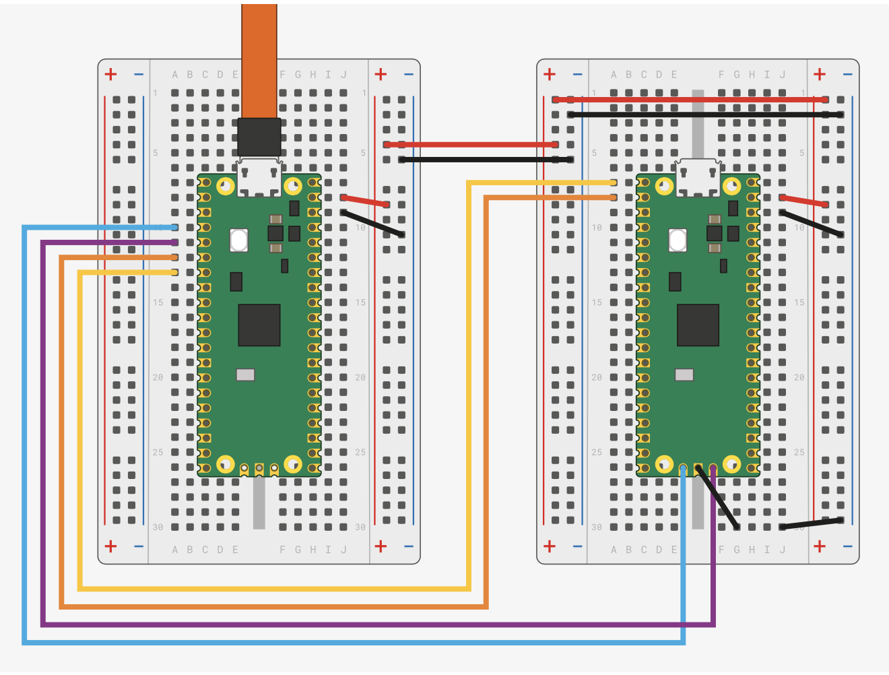

# PicoDebugger

The PicoDebugger project is an extension the Raspberry Pi Foundations PicoProbe project.  The basis of the PicoProbe is to use a Raspberry Pi Pico to act as a debug probe for another Pico.

There are two elements to this project:

* PicoProbe Software (from Raspberry Pi Foundation)
* PicoDebugger hardware

The aim is to provide a physically stable set up for the debug probe, the target Pico and to also allow connection to hardware under development.

This document will use the following terminology:

* Picoprobe - the Raspberry Pi Pico programmed with the PicoProbe software.  This will act as a debug probe for the host computer.
* Target - this is the Raspberry Pi Pico that is being debugged.

## History

The idea came about as I was developing some software using the NuttX RTOS on the Pico.  I had some spare Pico boards available, it was just a case of wiring them up.  The Fritzing diagram in the Raspberry [Getting Started Guide](https://datasheets.raspberrypi.com/pico/getting-started-with-pico.pdf) shows how to connect a Pico as a debug probe to a target Pico:

This lead to a quick hack and a development board put together on protoboard:

The next step is to break out KiCad an put together a solution that will allow connections from the target board to additional development hardware.

## PicoProbe Software

The Raspberry Pi Foundation have done the hard work by producing the software for the PicoProbe and the PicoDebug probe.  You can find more information in the [PicoProbe GitHub Repository](https://github.com/raspberrypi/picoprobe).  This repository contains the links to the documents detailing how to set up a Pico as a debug probe.

The software allows for two types of connection:

* SWD debug
* UART

SWD allows the host computer to connect to the target board and deploy and debug applications running on the board.

The UART connection will allow the application to generate user messages and also accept input from the host computer.

## PicoDebugger Hardware

The PicoDebugger aims to provide the following features:

* Mount a Pico to act as a Picoprobe
* Mount a target Pico
* Optionally connect UART from the target to the Picoprobe
* Reset the target board to allow programming by dragging a UF2 file to the target board
* Deployment and debugging using SWD
* Connection to external project hardware

Thanks to KiCad and [PCBWay](https://www.pcbway.com/), a few weeks later we have this:

Moving from the left to the right of the board.  The left of the board shows the Picoprobe soldered to the board.

The DIP switches allow the two UART lines between the Picoprobe and the target board to be connected / disconnected as required.

The three pin header to be connected to the SWD pins on the Pico or Pico W board.

The reset switch is connected to the reset pin on the target board allowing the target board to be programmed by dragging a UF2 file onto the board.

To the far right there is a 2x20 pin header which matches the pins on the target board.  Tis will allow the target board to be connected to development hardware.  This could be using individual dupont cables for a small number of connections or using an IDE cable to connect all 40 pins through to a project under development.

The full designs (KiCad 7) of this board are available in the [PCB](PCB) directory.

## PicoDebugger Mount

The image above shows the PicoDebugger board on a 3D printed base.  This base keeps the through hole parts from scratching and work surfaces and helps to reduce the possibility of unintended shorts on the exposed pins on the bottom of the board.

This part is available as a Fusion 360 part in the [3DDesigns](3DDesigns) folder.  This folder also contains the GCode the design.  The GCode is intended to be used on an Ender 3 Pro, using PLA.  The print has a 50% infill for rigidity.
